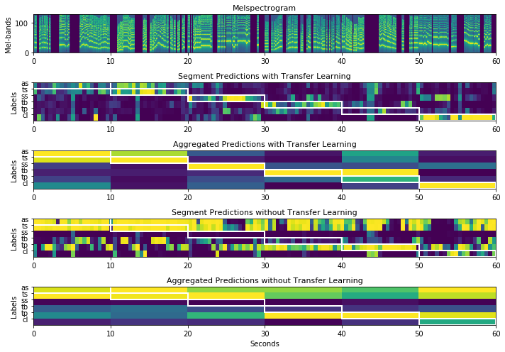

# Complementary website

## Publication

``` bibtex
@InProceedings{Gomez:2018:ISMIR,
	author = {Juan Gomez and Jakob Abe{\ss}er and Estefan{'i}a Cano},
	title = {Jazz Solo Instrument Classification with Convolutional Neural Networks, Source Separation, and Transfer Learning},
	year = {2018},
  booktitle = {Proceedings of the 19th International Society for Music Information Retrieval Conference (ISMIR)},
	address = {Paris, France},
}
```
## Content

This page provides
 * a Python demo file to create the show-case figure in the paper
 * Metadata to reconstruct the MONOTIMBRAL and JAZZ dataset from the abovementioned publication.

## Demo

This script loads trained instrument recognition neural networks and makes predictions on a collection of jazz solos. The instruments are: alto saxophone (as), tenor saxophone (ts), soprano saxophone (ss), trombone (tb), trumpet (tp), and clarinet (cl). You can choose between loading a model that uses the mixed audio or the solo separated audio. The neural network is based on the work by Han et al. (Deep convolutional neural networks for predominant instrument recognition - 2016) and the solo/accompaniment separation uses the algorithm by Cano et al. (Pitch-informed solo and accompaniment separation towards its use in music education applications - 2014). The model was implemented by training on a subset of the IRMAS data set (only wind instruments: clarinet, flute, saxophone, and trumpet) and applying transfer training for a new data set from Weimar Jazz Database.

### Python package requirements

```
pip install keras, matplotlib, numpy, librosa, h5py
```

### Predict and Plot

Just run the main file.

```
python3 demo_jazz_showcase.py
```

### Result



## Datasets

### MONOTIMBRAL dataset

The file monotimbral_dataset.csv contains a list of youtube URLs, segment information for 16 different musical instruments (monotimbral recordings, i.e., monophonic of polyphonic instrument recordings without overlap to other instruments). There are 30 recordings per instruments.

### JAZZ dataset

The JAZZ dataset was compiled from solos from the Weimar Jazz Database (WJD) (https://jazzomat.hfm-weimar.de/dbformat/dboverview.html) and additional jazz solo excerpts taken from youtube videos.
The file jazz_dataset.csv lists all the files in the dataset with their source (either WJD or YOUTUBE), the file jazz_dataset_youtube.csv lists the youtube URLs and metadata for the additional files taken from Youtube.

## Comment

* Youtube URLs can become obsolete after a while if the original video is removed

## Contact

* Please contact jakob.abesser[at]idmt.fraunhofer.de for further questions
